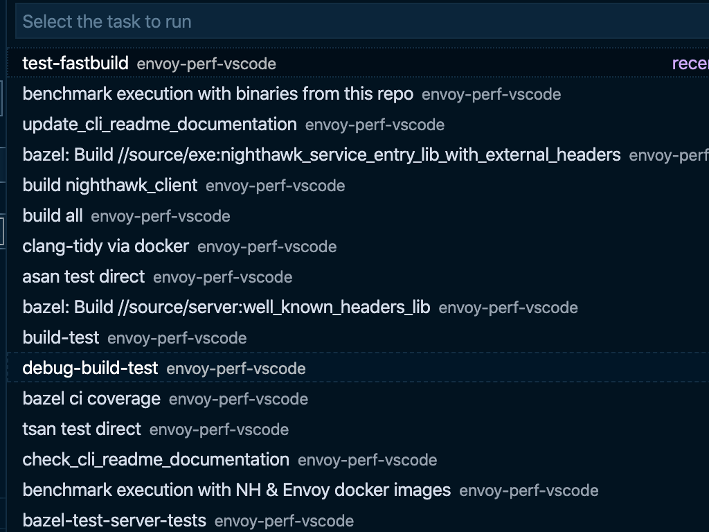

# Developing Nighthawk using VSCode

Install VSCode and click `file->open workspace` in the menu.
Next, open [nighthawk.code-workspace](../nighthawk.code-workspace).

You can now use `shift+ctrl+p` or `shitf-command+p` (osx) to run
various [tasks](tasks.json) associated to Nighthawk development,
by selecting `Tasks: run task` in the dropdown:

It's recommended to check out the plug-in gallery for facilitating
work with bazel, python and c++.

We are happy to answer any questions on getting started on
[Slack](https://envoyproxy.slack.com/archives/CDX3CGTT9).
