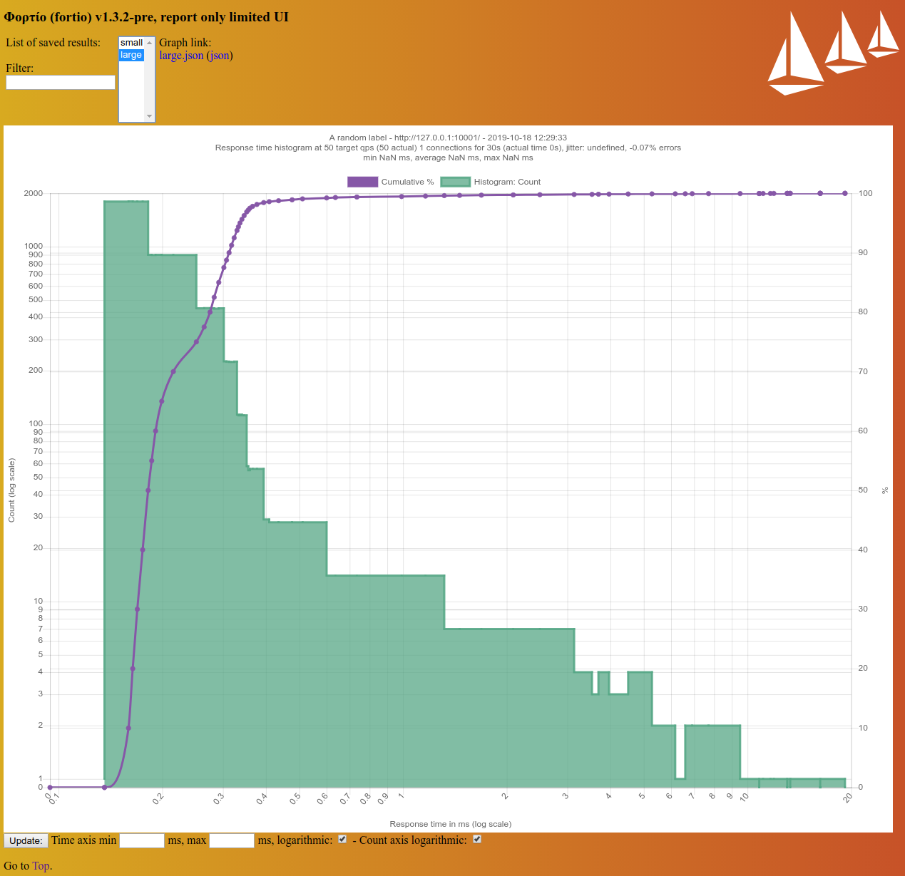

# Nighthawk

*A L7 (HTTP/HTTPS/HTTP2) performance characterization tool*

## Current state

Nighthawk currently offers:

- A load testing client which supports HTTP/1.1 and HTTP/2 over HTTP and HTTPS.
(HTTPS certificates are not yet validated).
- A simple [test server](source/server/README.md) which is capable of generating dynamic response sizes, as well as inject delays.
- A binary to transform nighthawk output to well-known formats, allowing integration with other systems and dashboards.

## Prerequisites

### Ubuntu

First, follow steps 1 and 2 over at [Quick start Bazel build for developers](https://github.com/envoyproxy/envoy/blob/main/bazel/README.md#quick-start-bazel-build-for-developers).


## Building and using the Nighthawk client CLI

For building the Nighthawk test server, see [here](source/server/README.md).

### Test it

```bash
bazel test -c dbg //test/...
```

### Build it

```bash
bazel build -c opt //:nighthawk
```

### Using the CLI

```bash
➜ bazel-bin/nighthawk_client --help
```

```
USAGE:

bazel-bin/nighthawk_client  [--allow-envoy-deprecated-v2-api]
[--latency-response-header-name <string>]
[--stats-flush-interval <uint32_t>]
[--stats-sinks <string>] ...
[--no-duration] [--simple-warmup]
[--request-source-plugin-config <string>]
[--request-source <uri format>] [--label
<string>] ... [--multi-target-use-https]
[--multi-target-path <string>]
[--multi-target-endpoint <string>] ...
[--experimental-h2-use-multiple-connections]
[--nighthawk-service <uri format>]
[--jitter-uniform <duration>] [--open-loop]
[--experimental-h1-connection-reuse-strategy
<mru|lru>] [--failure-predicate <string,
uint64_t>] ... [--termination-predicate
<string, uint64_t>] ... [--trace <uri
format>] [--sequencer-idle-strategy <spin
|poll|sleep>] [--max-requests-per-connection
<uint32_t>] [--max-active-requests
<uint32_t>] [--max-pending-requests
<uint32_t>] [--transport-socket <string>]
[--tls-context <string>]
[--request-body-size <uint32_t>]
[--request-header <string>] ...
[--request-method <GET|HEAD|POST|PUT|DELETE
|CONNECT|OPTIONS|TRACE>] [--address-family
<auto|v4|v6>] [--burst-size <uint32_t>]
[--prefetch-connections] [--output-format
<json|human|yaml|dotted|fortio
|experimental_fortio_pedantic>] [-v <trace
|debug|info|warn|error|critical>]
[--concurrency <string>] [--h2] [--timeout
<uint32_t>] [--duration <uint32_t>]
[--connections <uint32_t>] [--rps
<uint32_t>] [--] [--version] [-h] <uri
format>


Where:

--allow-envoy-deprecated-v2-api
Set to allow usage of the v2 api. (Not recommended, support will stop
in Q1 2021). Default: false

--latency-response-header-name <string>
Set an optional header name that will be returned in responses, whose
values will be tracked in a latency histogram if set. Can be used in
tandem with the test server's response option
"emit_previous_request_delta_in_response_header" to record elapsed
time between request arrivals. Default: ""

--stats-flush-interval <uint32_t>
Time interval (in seconds) between flushes to configured stats sinks.
Default: 5.

--stats-sinks <string>  (accepted multiple times)
Stats sinks (in json or compact yaml) where Nighthawk metrics will be
flushed. This argument is intended to be specified multiple times.
Example (json): {name:"envoy.stat_sinks.statsd"
,typed_config:{"@type":"type.googleapis.com/envoy.config.metrics.v3.St
atsdSink",tcp_cluster_name:"statsd"}}

--no-duration
Request infinite execution. Note that the default failure predicates
will still be added. Mutually exclusive with --duration.

--simple-warmup
Perform a simple single warmup request (per worker) before starting
execution. Note that this will be reflected in the counters that
Nighthawk writes to the output. Default is false.

--request-source-plugin-config <string>
[Request
Source](https://github.com/envoyproxy/nighthawk/blob/main/docs/root/ov
erview.md#requestsource) plugin configuration in json or compact yaml.
Mutually exclusive with --request-source. Example (json):
{name:"nighthawk.stub-request-source-plugin"
,typed_config:{"@type":"type.googleapis.com/nighthawk.request_source.S
tubPluginConfig",test_value:"3"}}

--request-source <uri format>
Remote gRPC source that will deliver to-be-replayed traffic. Each
worker will separately connect to this source. For example
grpc://127.0.0.1:8443/. Mutually exclusive with
--request_source_plugin_config.

--label <string>  (accepted multiple times)
Label. Allows specifying multiple labels which will be persisted in
structured output formats.

--multi-target-use-https
Use HTTPS to connect to the target endpoints. Otherwise HTTP is used.
Mutually exclusive with providing a URI.

--multi-target-path <string>
The single absolute path Nighthawk should request from each target
endpoint. Required when using --multi-target-endpoint. Mutually
exclusive with providing a URI.

--multi-target-endpoint <string>  (accepted multiple times)
Target endpoint in the form IPv4:port, [IPv6]:port, or DNS:port. This
argument is intended to be specified multiple times. Nighthawk will
spread traffic across all endpoints with round robin distribution.
Mutually exclusive with providing a URI.

--experimental-h2-use-multiple-connections
Use experimental HTTP/2 pool which will use multiple connections.
WARNING: feature may be removed or changed in the future!

--nighthawk-service <uri format>
Nighthawk service uri. Example: grpc://localhost:8843/. Default is
empty.

--jitter-uniform <duration>
Add uniformly distributed absolute request-release timing jitter. For
example, to add 10 us of jitter, specify .00001s. Default is empty /
no uniform jitter.

--open-loop
Enable open loop mode. When enabled, the benchmark client will not
provide backpressure when resource limits are hit.

--experimental-h1-connection-reuse-strategy <mru|lru>
Choose picking the most recently used, or least-recently-used
connections for re-use.(default: mru). WARNING: this option is
experimental and may be removed or changed in the future!

--failure-predicate <string, uint64_t>  (accepted multiple times)
Failure predicate. Allows specifying a counter name plus threshold
value for failing execution. Defaults to not tolerating error status
codes and connection errors.

--termination-predicate <string, uint64_t>  (accepted multiple times)
Termination predicate. Allows specifying a counter name plus threshold
value for terminating execution.

--trace <uri format>
Trace uri. Example: zipkin://localhost:9411/api/v1/spans. Default is
empty.

--sequencer-idle-strategy <spin|poll|sleep>
Choose between using a busy spin/yield loop or have the thread poll or
sleep while waiting for the next scheduled request (default: spin).

--max-requests-per-connection <uint32_t>
Max requests per connection (default: 4294937295).

--max-active-requests <uint32_t>
The maximum allowed number of concurrently active requests. HTTP/2
only. (default: 100).

--max-pending-requests <uint32_t>
Max pending requests (default: 0, no client side queuing. Specifying
any other value will allow client-side queuing of requests).

--transport-socket <string>
Transport socket configuration in json or compact yaml. Mutually
exclusive with --tls-context. Example (json):
{name:"envoy.transport_sockets.tls"
,typed_config:{"@type":"type.googleapis.com/envoy.extensions.transport
_sockets.tls.v3.UpstreamTlsContext"
,common_tls_context:{tls_params:{cipher_suites:["-ALL:ECDHE-RSA-AES128
-SHA"]}}}}

--tls-context <string>
DEPRECATED, use --transport-socket instead. Tls context configuration
in json or compact yaml. Mutually exclusive with --transport-socket.
Example (json):
{common_tls_context:{tls_params:{cipher_suites:["-ALL:ECDHE-RSA-AES128
-SHA"]}}}

--request-body-size <uint32_t>
Size of the request body to send. NH will send a number of consecutive
'a' characters equal to the number specified here. (default: 0, no
data).

--request-header <string>  (accepted multiple times)
Raw request headers in the format of 'name: value' pairs. This
argument may specified multiple times.

--request-method <GET|HEAD|POST|PUT|DELETE|CONNECT|OPTIONS|TRACE>
Request method used when sending requests. The default is 'GET'.

--address-family <auto|v4|v6>
Network address family preference. Possible values: [auto, v4, v6].
The default output format is 'AUTO'.

--burst-size <uint32_t>
Release requests in bursts of the specified size (default: 0).

--prefetch-connections
Use proactive connection prefetching (HTTP/1 only).

--output-format <json|human|yaml|dotted|fortio
|experimental_fortio_pedantic>
Output format. Possible values: {"json", "human", "yaml", "dotted",
"fortio", "experimental_fortio_pedantic"}. The default output format
is 'human'.

-v <trace|debug|info|warn|error|critical>,  --verbosity <trace|debug
|info|warn|error|critical>
Verbosity of the output. Possible values: [trace, debug, info, warn,
error, critical]. The default level is 'info'.

--concurrency <string>
The number of concurrent event loops that should be used. Specify
'auto' to let Nighthawk leverage all vCPUs that have affinity to the
Nighthawk process. Note that increasing this results in an effective
load multiplier combined with the configured --rps and --connections
values. Default: 1.

--h2
Use HTTP/2

--timeout <uint32_t>
Connection connect timeout period in seconds. Default: 30.

--duration <uint32_t>
The number of seconds that the test should run. Default: 5. Mutually
exclusive with --no-duration.

--connections <uint32_t>
The maximum allowed number of concurrent connections per event loop.
HTTP/1 only. Default: 100.

--rps <uint32_t>
The target requests-per-second rate. Default: 5.

--,  --ignore_rest
Ignores the rest of the labeled arguments following this flag.

--version
Displays version information and exits.

-h,  --help
Displays usage information and exits.

<uri format>
URI to benchmark. http:// and https:// are supported, but in case of
https no certificates are validated. Provide a URI when you need to
benchmark a single endpoint. For multiple endpoints, set
--multi-target-* instead.


L7 (HTTP/HTTPS/HTTP2) performance characterization tool.
```

### Nighthawk gRPC service

The gRPC service can be used to start a server which is able to perform back-to-back benchmark runs upon request. The service interface definition [can be found here.](https://github.com/envoyproxy/nighthawk/blob/59a37568783272a6438b5697277d4e56aa16ebbe/api/client/service.proto)


```bash
➜ bazel-bin/nighthawk_service --help
```

```
USAGE:

bazel-bin/nighthawk_service  [--service <traffic-generator-service
|dummy-request-source>]
[--listener-address-file <>] [--listen
<address:port>] [--] [--version] [-h]


Where:

--service <traffic-generator-service|dummy-request-source>
Specifies which service to run. Default 'traffic-generator-service'.

--listener-address-file <>
Location where the service will write the final address:port on which
the Nighthawk grpc service listens. Default empty.

--listen <address:port>
The address:port on which the Nighthawk gRPC service should listen.
Default: 0.0.0.0:8443.

--,  --ignore_rest
Ignores the rest of the labeled arguments following this flag.

--version
Displays version information and exits.

-h,  --help
Displays usage information and exits.


L7 (HTTP/HTTPS/HTTP2) performance characterization tool.
```

### Nighthawk output transformation utility

Nighthawk comes with a tool to transform its json output to its other supported output formats.


```bash
➜ bazel-bin/nighthawk_output_transform --help
```

```
USAGE:

bazel-bin/nighthawk_output_transform  --output-format <json|human|yaml
|dotted|fortio
|experimental_fortio_pedantic> [--]
[--version] [-h]


Where:

--output-format <json|human|yaml|dotted|fortio
|experimental_fortio_pedantic>
(required)  Output format. Possible values: {"json", "human", "yaml",
"dotted", "fortio", "experimental_fortio_pedantic"}.

--,  --ignore_rest
Ignores the rest of the labeled arguments following this flag.

--version
Displays version information and exits.

-h,  --help
Displays usage information and exits.


L7 (HTTP/HTTPS/HTTP2) performance characterization transformation tool.
```

## A sample benchmark run

```bash
# start the benchmark target (Envoy with a single worker in this case) on cpu-core 3.
➜ taskset -c 3 envoy --concurrency 1 --config-path ~/envoy.yaml

# run a quick benchmark using cpu-cores 4 and 5.
➜ taskset -c 4-5 bazel-bin/nighthawk_client --rps 1000 --connections 4 --concurrency auto --prefetch-connections -v info http://127.0.0.1:10000/
[21:28:12.690578][27849][I] [source/client/client.cc:71] Detected 2 (v)CPUs with affinity..
[21:28:12.690621][27849][I] [source/client/client.cc:75] Starting 2 threads / event loops. Test duration: 5 seconds.
[21:28:12.690627][27849][I] [source/client/client.cc:77] Global targets: 8 connections and 2000 calls per second.
[21:28:12.690632][27849][I] [source/client/client.cc:81]    (Per-worker targets: 4 connections and 1000 calls per second)
Nighthawk - A layer 7 protocol benchmarking tool.

Queueing and connection setup latency
  samples: 9992
  mean:    0s 000ms 002us
  pstdev:  0s 000ms 000us

  Percentile  Count       Latency
  0           1           0s 000ms 001us
  0.5         5013        0s 000ms 002us
  0.75        7496        0s 000ms 002us
  0.8         8008        0s 000ms 002us
  0.9         8996        0s 000ms 002us
  0.95        9493        0s 000ms 002us
  0.990625    9899        0s 000ms 003us
  0.999023    9983        0s 000ms 004us
  1           9992        0s 000ms 027us

Request start to response end
  samples: 9992
  mean:    0s 000ms 108us
  pstdev:  0s 000ms 061us

  Percentile  Count       Latency
  0           1           0s 000ms 073us
  0.5         4997        0s 000ms 111us
  0.75        7495        0s 000ms 113us
  0.8         7997        0s 000ms 114us
  0.9         8993        0s 000ms 116us
  0.95        9493        0s 000ms 120us
  0.990625    9899        0s 000ms 130us
  0.999023    9983        0s 000ms 528us
  1           9992        0s 004ms 083us

Initiation to completion
  samples: 9992
  mean:    0s 000ms 113us
  pstdev:  0s 000ms 061us

  Percentile  Count       Latency
  0           1           0s 000ms 077us
  0.5         4996        0s 000ms 115us
  0.75        7495        0s 000ms 118us
  0.8         7998        0s 000ms 118us
  0.9         8993        0s 000ms 121us
  0.95        9493        0s 000ms 124us
  0.990625    9899        0s 000ms 135us
  0.999023    9983        0s 000ms 588us
  1           9992        0s 004ms 090us

Counter                                 Value       Per second
client.benchmark.http_2xx               9994        1998.80
client.upstream_cx_http1_total          8           1.60
client.upstream_cx_overflow             2           0.40
client.upstream_cx_rx_bytes_total       36008382    7201676.40
client.upstream_cx_total                8           1.60
client.upstream_cx_tx_bytes_total       599640      119928.00
client.upstream_rq_pending_total        2           0.40
client.upstream_rq_total                9994        1998.80

[21:28:18.522403][27849][I] [source/client/client.cc:279] Done.
```

## Visualizing the output of a benchmark

Nighthawk supports transforming the output into other well-known formats, such as:

- `dotted`: Provides integration with Prometheus
- `fortio`: Provides integration with [Fortio's report-only UI](https://github.com/fortio/fortio#report-only-ui)

The following is an example of a nighthawk benchmark visualized via the Fortio UI.

```bash
fortio report --data-dir ./samples/fortio_data
```



## Accuracy and repeatability considerations when using the Nighthawk client

- Processes not related to the benchmarking task at hand may add significant noise. Consider stopping any
  processes that are not needed.
- Be aware that power state management and CPU Frequency changes are able to introduce significant noise.
  When idle, Nighthawk uses a busy loop to achieve precise timings when starting requests, which helps minimize this.
  Still, consider disabling C-state changes in the system BIOS.
- Be aware that CPU thermal throttling may skew results.
- Consider using `taskset` to isolate client and server. On machines with multiple physical CPUs there is a choice here.
  You can partition client and server on the same physical processor, or run each of them on a different physical CPU. Be aware of the latency effects of interconnects such as QPI.
- Consider disabling hyper-threading.
- Consider tuning the benchmarking system for low (network) latency. You can do that manually, or install [tuned](http://manpages.ubuntu.com/manpages/bionic/man8/tuned-adm.8.html) and run:

| As this may change boot flags, take precautions, and familiarize yourself with the tool on systems that you don't mind breaking. For example, running this has been observed to mess up dual-boot systems! |
| --- |

```bash
sudo tuned-adm profile network-latency
```

- When using Nighthawk with concurrency > 1 or multiple connections, workers may produce significantly different results. That can happen because of various reasons:
  - Server fairness. For example, connections may end up being serviced by the same server thread, or not.
  - One of the clients may be unlucky and structurally spend time waiting on requests from the other(s)
    being serviced due to interference of request release timings and server processing time.
- Consider using separate machines for the clients and server(s).
