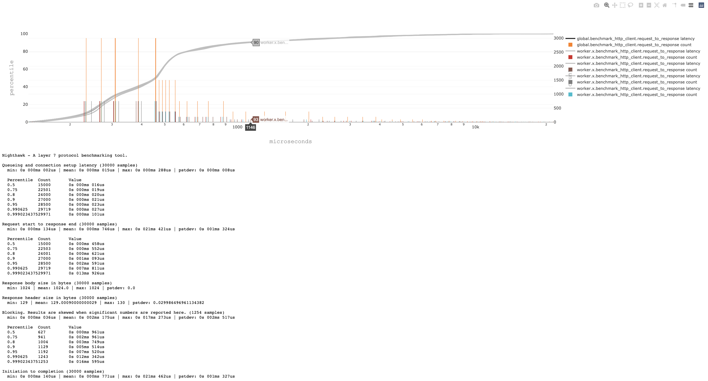

# Benchmarking testsuite

The NH benchmark test suite builds on top Nighthawk's integration test framework, and
can be used to scaffold tests and obtain latency reports as well as flamegraphs.

## Immediate goals

The goal is to be able to:

- facilitate integration into CI flows (via fully dockerized flow)
- facilitate A/B testing by developers
- run the suite against arbitrary Envoy revisions
- persist profile dumps, flamegraphs, and latency numbers per test
- offer stock tests, but also allow scaffolding consumer-specific tests

## Example output visualization

The benchmark will drop a visual in each test directory.



## Example: Docker based execution, scavaging benchmark/

This scripts shows how to use the benchmarking suite.
It will run a selection of an example [benchmarks](test/test_discovery.py)
extracted from `/benchmarks`, which injects Envoy between the benchmark client and test server.

```bash
git clone https://github.com/envoyproxy/nighthawk.git benchmark-test
cd benchmark-test
bazel build //benchmarks:benchmarks

# Specify the ip address family we'll be using. [v4only|v6only|all]
export ENVOY_IP_TEST_VERSIONS=v4only
# Explicit tmpdir for OSX Docker, to make sure we'll use a volume that works when
export TMPDIR="$(pwd)/benchmarks/tmp"
# Nighthawk tools will be sourced from this Docker image
export NH_DOCKER_IMAGE="envoyproxy/nighthawk-dev:latest"
# Envoy Docker image that we'll use to inject the Envoy proxy
export ENVOY_DOCKER_IMAGE_TO_TEST="envoyproxy/envoy-dev:74290ef76a76fbbf50f072dc33438791f93f68c7"
# Envoy is called 'Envoy' in the Envoy Docker image.
export ENVOY_PATH="envoy"

# run all tests starting with test_http_h1_small in benchmarks/
bazel-bin/benchmarks/benchmarks --log-cli-level=info -vvvv -k test_http_h1_small benchmarks/
```

## Example: running with binaries

This will build the Nighthawk binaries from the C++ code, and use those to
execute the benchmarks. Environment variable `ENVOY_PATH` can be used to
specify a custom Envoy binary to use to inject as a proxy between the test
client and server. If not set, the benchmark suite will fall back to configuring
Nighthawk's test server for that. Note that the build can be a lengthy process.

```bash
git clone https://github.com/envoyproxy/nighthawk.git benchmark-test
cd benchmark-test
bazel test \
  --test_summary=detailed \
  --test_output=all \
  --test_arg=--log-cli-level=info \
  --test_env=ENVOY_IP_TEST_VERSIONS=v4only \
  --test_env=HEAPPROFILE= \
  --test_env=HEAPCHECK= \
  --cache_test_results=no \
  --compilation_mode=opt \
  --cxxopt=-g \
  --cxxopt=-ggdb3 \
  --define tcmalloc=gperftools \
  //benchmarks:*
```

## Example: fully dockerized flow

The framework can be run via Docker and used that way to execute
Python benchmarks scripts not sourced from this repository, but
elsewhere. An example:

```bash
# This script runs the dockerized benchmarking framework, which in
# turn will pull Nighthawk and Envoy in via Docker.

set -eo pipefail
set +x
set -u

# The benchmark logs and artifacts will be dropped here
OUTDIR="/my-artifacts-dir/"
# Used to map the test that we want to see executed into the Docker container
# Note: the contents could be fetched via http, for example.
TEST_DIR="/dir-that-has-my-tests/"

# Rebuild the Docker in case something changed.
./docker_build.sh &&
docker run -it --rm \
  -v "/var/run/docker.sock:/var/run/docker.sock:rw" \
  -v "${OUTDIR}:${OUTDIR}:rw" \
  -v "${TEST_DIR}:/usr/local/bin/benchmarks/benchmarks.runfiles/nighthawk/benchmarks/external_tests/" \
  --network=host \
  --env NH_DOCKER_IMAGE="envoyproxy/nighthawk-dev:latest" \
  --env ENVOY_DOCKER_IMAGE_TO_TEST="envoyproxy/envoy-dev:f61b096f6a2dd3a9c74b9a9369a6ea398dbe1f0f" \
  --env TMPDIR="${OUTDIR}" \
  envoyproxy/nighthawk-benchmark-dev:latest ./benchmarks --log-cli-level=info -vvvv
```

# TODOs

- Copy out the artifacts and push those to a gcp bucket. Current status:
  - cpu profiles are dumped to tmp per test (named according to the test). ideally we'd
    also dump flamegraph svg's
- Enhance the UI. Currently we rely on CircleCI to directory-list our artifacts. This is
  is pretty bare-bones, ideally we'd have something more fancy and we would be able to
  visualize test data historically.
- Use taskset/cpuset when starting processes.
- Offer a docker image with binaries pre-built for profiling + the python test framework.
- Multi-origin support. The integration tests support it, but this isn't fitted into
  the benchmark framework yet. This _might_ just be a doc issue.

# FUTURE

- The current status can collect CPU profiles, but these are useless
  without access to the binary & libs that have been involved in producing them.
- profiling / flamegraphing via perf/bcc tools
- Allow injection of other proxies: nginx, haproxy
- Allow using alt clients, like Fortio & wrk2
- An app that integrates fortios UI, pprof's web UI
- Have a mode where nighthawk_test_server provides high-res control timings in its
  access logs
- The ability to repeat the runs multiple times and obtain stats, e.g. how much variance there is, mean, etc.
- The ability to do A/B testing, similar to https://github.com/envoyproxy/envoy-perf/blob/main/siege/siege.py#L3.
