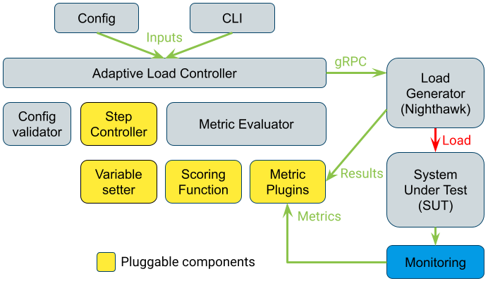

# The Adaptive Load Controller

The adaptive load controller is a standalone
[library](https://github.com/envoyproxy/nighthawk/tree/main/source/adaptive_load)
with [proto based
API](https://github.com/envoyproxy/nighthawk/tree/main/api/adaptive_load). It is
an abstraction built on to of Nighthawk that implements an adaptive execution mode.

## Motivation

When executing Nighthawk in [closed-loop](terminology.md#closed-loop) or
[open-loop](terminology.md#open-loop) mode, the test configuration must specify
the load level to deliver to the system under test, i.e. the number of requests
per second (RPS). When running tests continuously over a longer time period,
this configuration needs to be manually maintained and may get obsolete as the
performance of the system under test changes over time.

When executing Nighthawk in the adaptive mode, the adaptive load controller
automatically determines the maximum load specification the system under test
can sustain and still meet some defined criteria (e.g. success rate, latency,
etc...). This decreases test maintenance and allows to monitor how the
performance of the system under test evolves over time. The maximum load
specification is further referred to as the optimal configuration.

## The adaptive mode

The execution is broken into two stages in the adaptive mode:

*  The adaptive (search) stage.
*  The testing stage.


In the **adaptive stage** the adaptive load controller iteratively executes
Nighthawk with varying test parameters in search for the optimal configuration.
The individual Nighthawk executions use the
[open-loop](terminology.md#open-loop) mode. The controller collects metrics
after each iteration and evaluates them according to configured thresholds in
order to determine of the configuration used in the iteration is optimal. Once
the controller finds the optimal test configuration, it enters the testing
stage.

In the **testing stage** the adaptive load controller delivers load to the
system under test using the optimal test configuration found in the adaptive
stage.

### Example adaptive mode execution

The following diagram illustrates an execution when using the adaptive mode.


## Architecture

This diagram outlines the architecture of the adaptive load controller:



The **adaptive load controller** binary talk to a Nighthawk server over gRPC.
The controller accepts its
[configuration](https://github.com/envoyproxy/nighthawk/blob/main/api/adaptive_load/adaptive_load.proto)
in protocol buffer format.

The **config validator** validates the provided configuration, ensuring that
the adaptive mode can successfully execute.

The **step controller** executes the chosen search algorithm (e.g. exponential
search) and uses the **variable setter** to alter Nighthawk's configuration used
in individual iterations.

The **metric evaluator** decides whether metrics observed in an iteration are
within bounds specified in the configuration. It utilizes a **scoring function**
that represents the observed metrics as a score usable by the search algorithm.

The **metric evaluator** uses the **metric plugins** to receive the metric
values.

## Available plugin implementations

The yellow components in the architecture diagram above are implemented as
plugins using the [Envoy
plugin](https://github.com/envoyproxy/envoy/blob/main/envoy/registry/registry.h)
architecture. Users of Nigthhawk can create and use their own implementations
of these components. This section of the document lists the plugin
implementations that are included in this repository.

### Available metric plugins

The existing metrics plugins are implemented in the
[metrics_plugin_impl.cc](https://github.com/envoyproxy/nighthawk/blob/main/source/adaptive_load/metrics_plugin_impl.cc)
file.

Metric Plugin          | Plugin Name                   | Description
---------------------- | ----------------------------- | -----------
Attempted RPS          | `attempted-rps`               | The request per seconds (RPS) value Nighthawk attempted in the iteration.
Achieved RPS           | `achieved-rps`                | The request per seconds (RPS) value Nighthawk achieved in the iteration.
Send rate              | `send-rate`                   | A percentage of planned requests that Nighthawk managed to send in the iteration.
Success rate           | `success-rate`                | A percentage of the sent requests that resulted in HTTP code 200 in the iteration.
Minimum latency        | `latency-ns-min`              | The minimum latency in nanoseconds observed by Nighthawk in the iteration.
Mean latency           | `latency-ns-mean`             | The average latency in nanoseconds observed by Nighthawk in the iteration.
Maximum latency        | `latency-ns-max`              | The maximum latency in nanoseconds observed by Nighthawk in the iteration.
Mean + 1*stdev latency | `latency-ns-mean-plus-1stdev` | Calculated as average latency plus one standard deviation in nanoseconds as observed by Nighthawk in the iteration.
Mean + 2*stdev latency | `latency-ns-mean-plus-2stdev` | Calculated as average latency plus two standard deviations in nanoseconds as observed by Nighthawk in the iteration.
Mean + 3*stdev latency | `latency-ns-mean-plus-3stdev` | Calculated as average latency plus three standard deviations in nanoseconds as observed by Nighthawk in the iteration.
Stdev latency          | `latency-ns-pstdev`           | The standard deviation of latencies in nanoseconds as observed by Nighthawk in the iteration.

### Available step controllers

The existing step controllers are implemented in the
[step_controller_impl.cc](https://github.com/envoyproxy/nighthawk/blob/main/source/adaptive_load/step_controller_impl.cc)
file.

Step controller      | Plugin Name                    | Description
-------------------- | ------------------------------ | -----------
Exponential search   | `nighthawk.exponential_search` | Implements the exponential search algorithm.

### Available metric scoring functions

The existing metric scoring functions are implemented in the
[scoring_function_impl.cc](https://github.com/envoyproxy/nighthawk/blob/main/source/adaptive_load/scoring_function_impl.cc)
file.

Scoring function | Plugin Name                | Description
---------------- | -------------------------- | -----------
Binary scoring   | `nighthawk.binary_scoring` | A boolean (true/false) evaluation of the metric value.
Linear scoring   | `nighthawk.linear_scoring` | Evaluation of the metric value with a linear scoring constant.

### Available input variable setters

The existing input variable setters are implemented in the
[input_variable_setter_impl.cc](https://github.com/envoyproxy/nighthawk/blob/main/source/adaptive_load/input_variable_setter_impl.cc)
file.

Input variable setter | Plugin Name     | Description
--------------------- | --------------- | -----------
RPS                   | `nighthawk.rps` | Sets the RPS value in the Nighthawk configuration for an iteration.

## Configuration

The controller accepts its
[configuration](https://github.com/envoyproxy/nighthawk/blob/main/api/adaptive_load/adaptive_load.proto)
in protocol buffer format.

A valid configuration contains a `nighthawk_traffic_template` which is the base
configuration for Nighthawk to be used in the iterations. The chosen input
variable setter alters variables in this template.

The configuration also contains a selection of plugins, their individual
configuration and a set of timers that determine the duration and deadline of
the individual stages used in the adaptive mode.

The following outlines an example configuration for the adaptive mode that uses
the exponential search algorithm to find an RPS value that achieves more than
99% of the `send-rate` metric:

```
metric_thresholds {
  metric_spec { metric_name: "send-rate" }
  threshold_spec {
    scoring_function {
      name: "nighthawk.binary_scoring"
      typed_config {
        [type.googleapis.com/nighthawk.adaptive_load.BinaryScoringFunctionConfig] {
          lower_threshold { value: 0.99 }
        }
      }
    }
  }
}

step_controller_config {
  name: "nighthawk.exponential_search"
  typed_config {
    [type.googleapis.com/nighthawk.adaptive_load.ExponentialSearchStepControllerConfig] {
      initial_value: 200
      input_variable_setter {
        typed_config {
          [type.googleapis.com/nighthawk.adaptive_load.RequestsPerSecondInputVariableSetterConfig] { }
        }
      }
    }
  }
}

measuring_period { seconds: 30 }

benchmark_cooldown_duration { seconds: 60 }

convergence_deadline { seconds: 1200 }

testing_stage_duration { seconds: 60 }
```

It is recommended to use configuration that contains at least two metric
thresholds to ensure stable test results. A typical adaptive mode configuration
will contain the following metric thresholds:

*  Send rate to ensure Nighthawk has enough resources to deliver the load.
*  Success rate to ensure the System under test is responding.
*  Latency to ensure the system under test responds in reasonable time.
*  CPU usage of the system under test to get a direct feedback on how much load
   is landing on it.
