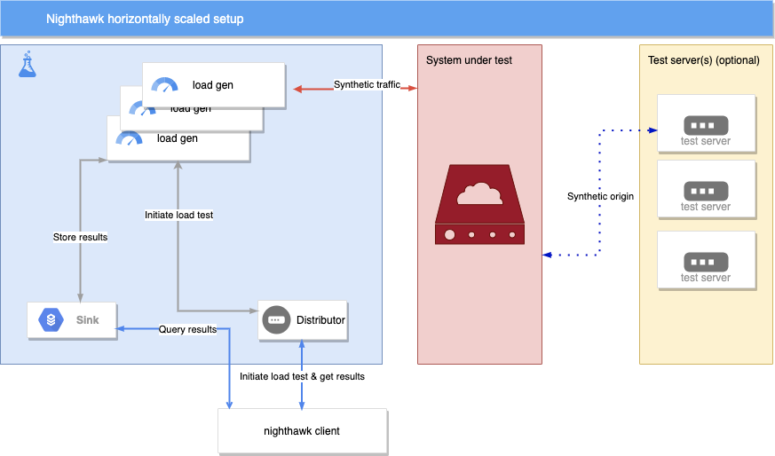

#Horizontally scaling tests with Nighthawk

# *Features described here are a work in progress *

Nighthawk makes it easy to pressurize large scale systems by allowing multiple load generators to work in tandem, while results get propagated to a central location.

High level, a horizontally scaled test setup may look as follows.

In more detail, it is also possible to involve Nighthawk's request source extension and the adaptive load controller.

After deployment, the experience of executing distributed tests execution will be almost identical to non-distributed test execution. There will be new arguments to point out the deployed Sink and Distributor servies, but that aside, proto api- and cli-usage will not change.

