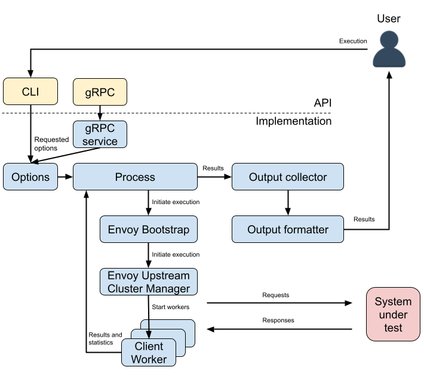
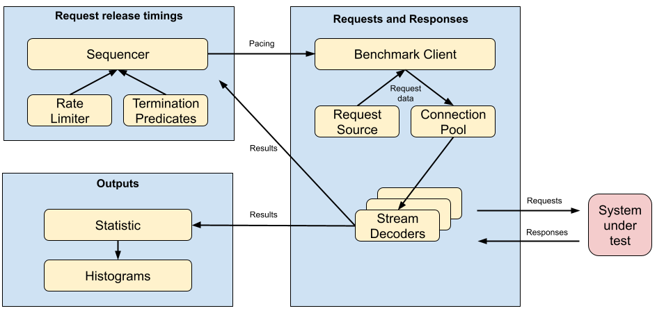

# Nighthawk: architecture and key concepts

## Architecture

The following diagram outlines the overall architecture of Nighthawk.

Nighthawk exposes its API either via a [command line
interface](../../source/exe/client_main_entry.cc) (CLI) or as a [gRPC
server](../../source/exe/service_main_entry.cc) with a [proto
API](../../api/client/service.proto).
When running as a CLI, Nighthawk will run a single execution and print out the
results. When running as a gRPC server, Nighthawk is capable of performing
multiple executions one after another, returning results to the gRPC client.

In either of the execution modes, the
[Options](../../source/client/options_impl.h) object abstracts all the
[options](../../api/client/options.proto) selected by the user and provides them
to the rest of the Nighthawk architecture.

Nighthawk creates a [Process](../../source/client/process_impl.h)
instance that generates Envoy bootstrap configuration capable of upstreaming
requests with the protocol and options selected by the user. This bootstrap is
used to initialize an Envoy upstream cluster manager.

The **Process** instance creates multiple [Client
workers](../../source/client/client_worker_impl.h) that get access to the Envoy
upstream cluster manager and drive the execution.
See the [next section](#client-worker-architecture) for a detail view into the
worker architecture.

Once the execution finishes, the [Output
Collector](../../source/client/output_collector_impl.h)
provides results collected from individual **Client workers** to the [Output
formatter](../../source/client/output_formatter_impl.h)
which represents the results in the format selected by the user.

### Client worker architecture

Each **Client worker** runs a
[Sequencer](../../source/common/sequencer_impl.h)
which is responsible for maintaining the pace of requests that was specified by
the user. To maintain the pace, the **Sequencer** queries a
[RateLimiter](../../source/common/rate_limiter_impl.h)
for [request-release timing](terminology.md#request-release-timing). At
appropriate intervals, the **Sequencer** asks the **BenchmarkClient** to send
requests.

When it
is time to release a request, the
[BenchmarkClient](../../source/client/benchmark_client_impl.h)
is requested to do so by the **Sequencer**.

**BenchmarkClient** retrieves data for the next request from the configured
[RequestSource](../../source/common/request_source_impl.h)
and asks its underlying **Connection pool** to create a
[StreamDecoder](../../source/client/stream_decoder.h). A **StreamDecoder**
instance manages the full lifetime of a single request. There are multiple
instances of **StreamDecoder**, one per request. The **StreamDecoder** sends
the request and processes events (connection pool ready, completion, etc...) as
it progresses.

The timings of each request along with other statistics are recorded into the
[Statistic](../../source/common/statistic_impl.h)
object and reported to the **Sequencer** for tracking of the in-flight work.

The **Sequencer** is also responsible for termination of the execution. This is
done by querying
[TerminationPredicates](../../source/common/termination_predicate_impl.h)
to determine if the configured conditions for termination have been reached.

## Key concept descriptions

*The c++ interface definitions for the concepts below can be found [here](https://github.com/envoyproxy/nighthawk/tree/main/include/nighthawk)*.

### Process

**Process** represents the primary entry point to a Nighthawk execution run.
Only one Process is allowed to exist at the same point in time within an OS
Process. **Process** is responsible for performing process-wide initialization
and termination, as well as handle input configuration, deliver output, and
co-ordinate Workers. **ProcessImpl** is re-used across the CLI and the gRPC
service.

### Worker

**Worker** is responsible for performing correct initialization and termination
of its thread, as well as execution of its designated task and offering a way
for consumers to wait for that task to complete.

### TerminationPredicate

**TerminationPredicate** is responsible for if and how to terminate. As of
today, there are two types: one that will indicate that it is time to terminate
based on a pre-configured duration, and one that will do so based on absolute
counter thresholds.

### Sequencer

**SequencerImpl** resides on a worker-thread, and drives itself via timers that
run on the dispatcher, and coordinates interaction between **RateLimiter,**
**BenchmarkClient**, and **TerminationPredicate** to drive execution to
completion.

### RateLimiter

**RateLimiter** is responsible for indicating when it is time to release a
request. **RateLimiter** offers a semaphore-like interaction model, as in
[closed-loop](terminology.md#closed-loop) mode it may be that
**BenchmarkClient** is not able to satisfy request-release timings, in which
case acquisitions from **RateLimiter** need to be cancelled. Concretely, as of
today there is **LinearRateLimiterImpl** which offers a straight-paced plain
frequency, as well as work in progress on
**DistributionSamplingRateLimiterImpl** (adding uniformly distributed random
timing offsets to an underlying **RateLimiter**) and **LinearRampingRateLimiter**.

### BenchmarkClient

As of today, there’s a single implementation called **BenchmarkClientImpl**,
which wraps Envoy’s **Upstream** concept and (slightly) customized H1/H2/H3
**Connection Pool** concepts. For executing requests, the connection pool will
be requested to create a **StreamEncoder**, and Nighthawk will pass its own
**StreamDecoderImpl** into that as an argument. The integration surface between
**BenchmarkClient** is defined via `BenchmarkClient::tryStartRequest()` and a
callback specification which will be fired upon completion of a successfully
started request.

### RequestSource

**RequestSource** is an abstraction that allows us to implement different ways
for **BenchmarkClient** to get information on what the request that it is about
to fire off should look like. A couple of implementations exist:

- a [static
  one](https://github.com/envoyproxy/nighthawk/blob/9f97c2d9cb86b84a158ccba33832d135e1b96c7a/source/common/request_source_impl.h#L20),
  which will repeat the same request over and over.
- a [dynamic
  one](https://github.com/envoyproxy/nighthawk/blob/9f97c2d9cb86b84a158ccba33832d135e1b96c7a/source/common/request_source_impl.h#L41)
  that pulls request data from a gRPC service. This one can be used to implement
  log-replay.
- a request source
  [plugin](https://github.com/envoyproxy/nighthawk/blob/9f97c2d9cb86b84a158ccba33832d135e1b96c7a/source/request_source/request_options_list_plugin_impl.h#L61)
  which reads request from a file.
- a request source
  [plugin](https://github.com/envoyproxy/nighthawk/blob/9f97c2d9cb86b84a158ccba33832d135e1b96c7a/source/request_source/request_options_list_plugin_impl.h#L94)
  which replays requests from memory.

### StreamDecoder

**StreamDecoder** is a Nighthawk-specific implementation of an [Envoy
concept](https://github.com/envoyproxy/envoy/blob/3156229006a5340b65c773329070737f67e81826/include/envoy/http/filter.h#L463).
StreamDecoder will by notified by Envoy as headers and body fragments arrive.
The Nighthawk implementation of that is responsible for coordinating lifetime
events of a request to upper abstraction layers (**BenchmarkClient**,
**Sequencer**) as well as recording latency and reporting that upwards.

### OutputCollector

**OutputCollector** is a container that facilitates building up the native output
format of Nighthawk (`proto3`, `nighthawk::client::Output`). It is the basis for all
output formats offered by Nighthawk, including CLI human output.

### OutputFormatter

**OutputFormatter** is responsible for transformations of `nighthawk::client::Output`
to requested formats (e.g. human, json, fortio, etc)

### Statistic

Nighthawk’s **Statistic** is responsible for administrating latencies. The most
notable implementation that exists today wraps
[HdrHistogram](https://github.com/HdrHistogram/HdrHistogram_c), but Nighthawk
also has a couple of other implementations which mostly exist to ensure that
floating point math is correct in tests, as well as a simple efficient
implementation that simply tracks the `mean` and `pstddev` for those cases where
we don't need percentiles. For various reasons, HdrHistogram might get replaced
by [libcirclhist](https://github.com/envoyproxy/nighthawk/issues/115) in the
near future.

### H1 & H2 Connection pools

Nighthawk derives its own version of these from the vanilla Envoy ones. It does
that to implement things like pro-active connection pre-fetching and H2
multi-connection support, as well as offer more connection management
strategies.

## Nighthawk binaries

### nighthawk_client

The CLI interface of the Nighthawk client. It synthesizes traffic according
to the requested configuration and report results in the requested output format.

### nighthawk_service

Nighthawk’s gRPC service is able to execute load tests, and report results.
Under the hood it shares much of the code of nighthawk_client, and effectively
it allows to efficiently perform remote back-to-back executions of that.

### nighthawk_test_server

Nighthawk’s test server, based on Envoy. It is able to synthesize delays and
responses based on configuration via request headers (next to on-disk
configuration).

### nighthawk_output_transform

Utility for transforming the nighthawk-native json output format into
other formats (e.g. human, fortio). It can be very useful to always store the
json output format, yet be able to easily get to one of the other output
formats. It’s like having the cake and eating it too!

## Notable upcoming changes

Calling out two new concepts that may get proposed in the future, and cause some
churn in the code base as we inject them.

### Phases

One notable addition / change that may get proposed in the near future is the
introduction of **Phase**. **Phase** would represent a distinct stage of an
execution, for example a warm-up. It would then be useful to have
per-phase reporting of latencies as well as counters and latencies.

Concretely, a warm-up phase could be represented by a distinct duration
termination predicate and a ramping rate limiter. Upon completion, the `hot`
BenchmarkClient with its associated connection pool would then be
live-transferred to the next configured phase, after which execution can
continue.

One other reason to have this is that it would enable remote- and/or cli-
controlled ramping of certain test parameters by associating those to different
phases. Termination predicates can be leveraged to immediately terminate the
current phase after injecting a new one, allowing for real-time steering via
gRPC and/or CLI.

### Streaming parameterization and output stats

Once we have phases, the gRPC service, and perhaps the CLI, would be natural
candidates to follow up with to allow dynamic phase injection, as well as send
back reports per phase.

## User-specified Nighthawk logging

Users of Nighthawk can specify custom format and destination (logging sink
delegate) for all Nighthawk logging messages. Nighthawk utilizes the Envoy's
logging mechanism by performing all logging via the **ENVOY_LOG** macro. To
customize this mechanism, users need to perform two steps:
1. Create a logging sink delegate inherited from [Envoy SinkDelegate](https://github.com/envoyproxy/envoy/blob/main/source/common/common/logger.h).
2. Construct a ServiceImpl object with an [Envoy Logger Context](https://github.com/envoyproxy/envoy/blob/main/source/common/common/logger.h) which contains user-specified log level and format.
