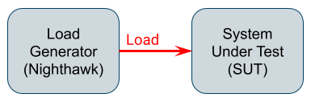

# Terminology

## Blocking

In [closed-loop](#closed-loop) mode, Nighthawk may delay
[request-release-timings](#request-release-timing) because it needs to wait on
the server. We call this blocking, and when that happens it gets reported in a histogram.

## Closed-loop

In closed-loop mode, there is a feedback loop between the test subject and the
test system. Concretely, Nighthawk will track and report [blocking](#blocking).
When this happens, the current linear rate limiter will attempt to compensate
pacing.

When significant blocking is observed, measurements are skewed. Therefore,
open-loop testing should be considered the preferred mode when measuring latency.

Closed-loop testing can be useful to get a sense of the maximum requests per
second that can be squeezed out of a system (irrespective of the high latency
incurred), as well as for comparing numbers with other load generators that use
this methodology.

See also the [adaptive mode](adaptive_load_controller.md) which allows to
determine the maximum requests per second without incurring the high latency.

## Execution

When we talk about execution, we are referring to a single load test run.

## Open-loop

In open-loop mode, there is no feedback loop between the test subject and the
test system. Consequently, Nighthawk will never report [blocking](#blocking),
and rate limiters will never attempt to correct for delayed timings.

In case an execution overflows configured resource limits, that will get reported
via counters (pool overflows), and the requests involved will be skipped.

## Request-release timing

This refers to the timings that Nighthawk comes up with for sending requests
according to its configuration. For example a configured linear pace of 2Hz
should consistently yield a request every .5 seconds.
